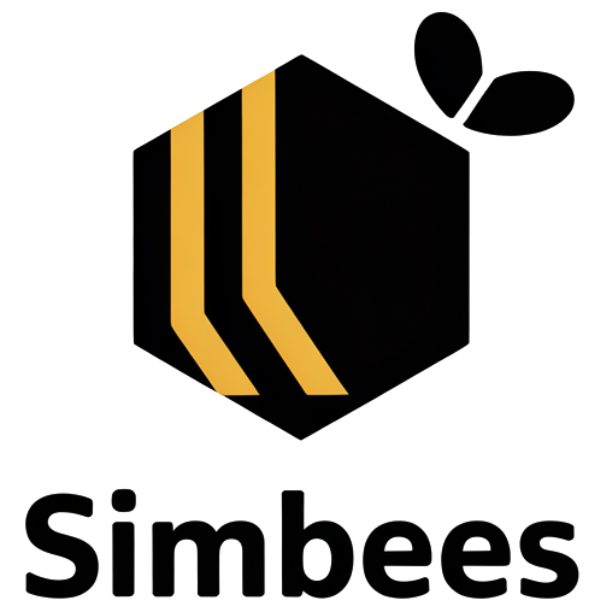

# 🐝 Simbees - Strategic Business Simulation

A sophisticated business simulation game where teams compete as companies making strategic decisions about production, marketing, and pricing. Built with Next.js and designed for educational and corporate training environments.



## 🎯 Game Overview

Simbees simulates realistic business competition where 4 teams (Red Corp, Blue Industries, Green Enterprises, Yellow Solutions) make strategic decisions each round:

- **Production Lines** (1-10): Determines capacity and unit costs with economies of scale
- **Marketing Spend**: Drives demand with diminishing returns
- **Unit Price**: Balances demand attraction vs. profit margins

## 🧮 Business Logic

### Production Economics
- Production capacity = lines × 1,000 units
- Unit cost decreases with scale: `max(1, 10 - lines × 0.5)`
- Fixed cost: $5,000 per production line

### Market Dynamics
- Base market: 10,000 units
- Marketing effectiveness: `√(spend/1000)`
- Price attractiveness: `50/price`
- Demand = `base × marketing × price_attractiveness / 100`
- Units sold = `min(capacity, demand)`

### Scoring System
- **40%** Profit weight
- **30%** Market share weight
- **20%** Revenue weight
- **10%** Efficiency weight (profit per unit)

## 🚀 Getting Started

### Prerequisites
- Node.js 18+ 
- npm or yarn

### Installation

```bash
# Clone the repository
git clone https://github.com/thesimbees/simbees.git
cd simbees

# Install dependencies
npm install

# Start development server
npm run dev
```

Open [http://localhost:3000](http://localhost:3000) to play the game.

## 🎮 How to Play

1. **Setup**: 4 teams prepare their strategies
2. **Decision Phase**: Each team submits:
   - Number of production lines (1-10)
   - Marketing budget ($0+)
   - Unit price ($0.01+)
3. **Processing**: Game calculates results using realistic business formulas
4. **Results**: View rankings, profits, market share, and detailed calculations
5. **Next Round**: Teams adapt strategies based on results

## 🏗️ Architecture

- **Frontend**: Next.js 15 with React 18
- **Styling**: Tailwind CSS
- **State Management**: React hooks
- **Business Logic**: Transparent calculations with detailed breakdowns
- **UI Components**: Professional dashboard with real-time updates

## 📊 Features

- **Real-time Competition**: 4 teams compete simultaneously
- **Transparent Calculations**: Full formula breakdowns for learning
- **Professional UI**: Corporate-grade dashboard design
- **Educational Focus**: Teaches strategic thinking and market dynamics
- **Customizable**: Easy to modify rules and parameters
- **Responsive Design**: Works on desktop and mobile

## 🎓 Educational Use Cases

- **Business Schools**: Strategy and economics courses
- **Corporate Training**: Decision-making workshops
- **Team Building**: Strategic collaboration exercises
- **Game Theory**: Practical application of competitive dynamics

## 🛠️ Customization

The game is designed to be easily customizable:

- Modify business formulas in `calculateBusinessResults()`
- Adjust scoring weights in `calculateRankings()`
- Change team names and colors in the initial state
- Add new metrics or decision parameters

## 📝 License

MIT License - feel free to use this as a starting point for your own business simulations.

## 🤝 Contributing

Contributions welcome! This project serves as a template for business simulation games. Feel free to:

- Add new game mechanics
- Improve the UI/UX
- Create new scenarios
- Add multiplayer features
- Enhance educational content

## 🐝 About Simbees

Simbees combines the strategic depth of business simulation with the accessibility of modern web technology. Whether you're teaching economics, training executives, or just exploring competitive strategy, Simbees provides a solid foundation for learning through play.

---

**Built with ❤️ for educators, trainers, and strategic thinkers everywhere.**
